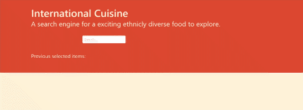
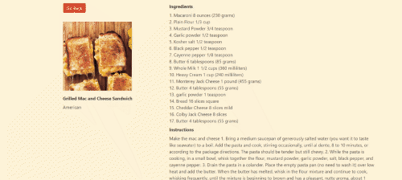

# International Cuisine
## The Contents

- [Usage](#usage)
- [Description](#description)
- [Visuals](#visuals)
- [Final product](#final-product)

## Usage 
   The drop down selector allows the user to pick from the data base categories.  
   The items in the category are displayed for the user to select.  
   After an item is selected the user is guided to a details page that allows  
   them to see all the neccisary information to prepare the item they selected.  
   The option to go back is avalible to take the user back to the selector to make  
   a new search or to see there last 5 item searches.
 

## Description
   The website runs using to data base API's that provide the information  
   on food and drinks. The styling of the website is based on the Bulma CDN  
   withsome modifications in a style.css document. The JavaScript was designed  
   to run the dropdown menus options as a conditional stated as the meals  
   first then searching for drink options. The details page is ran after the  
   specifics of the selected dish or drink are retrieved and linked through  
   the JavaScript.

## Visuals
  

## Final Product
[Final](https://mchapm17.github.io/international-cuisine/)